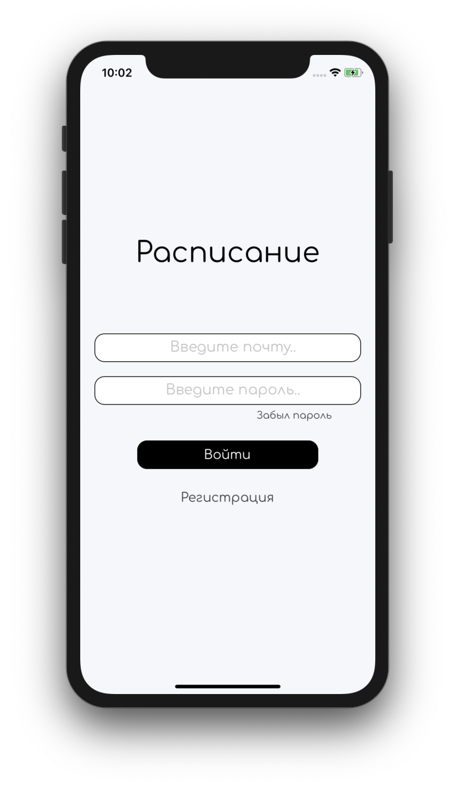
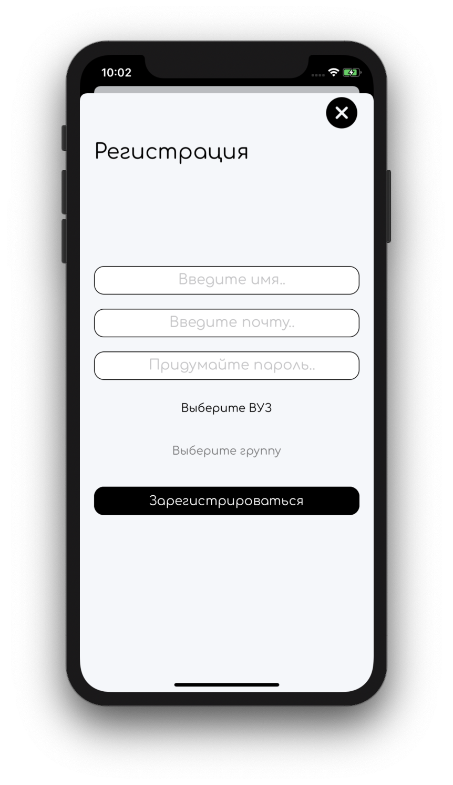
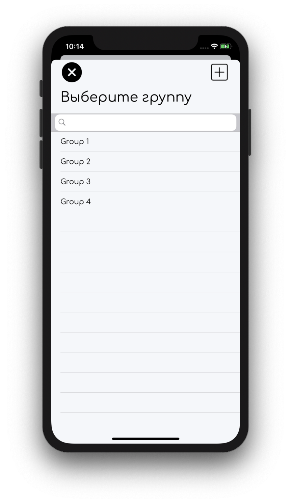
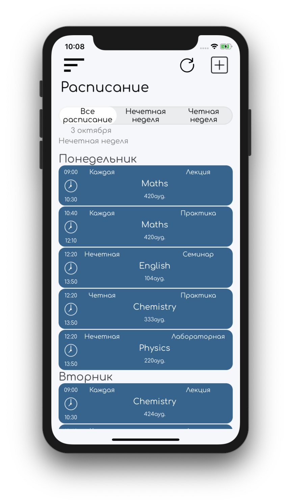
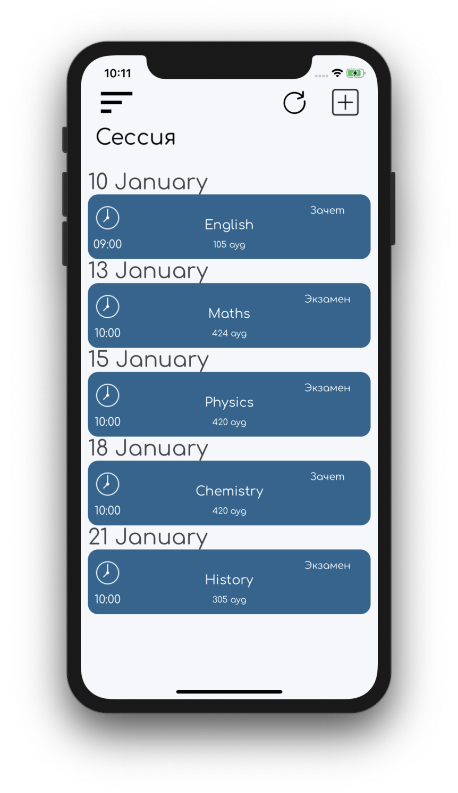
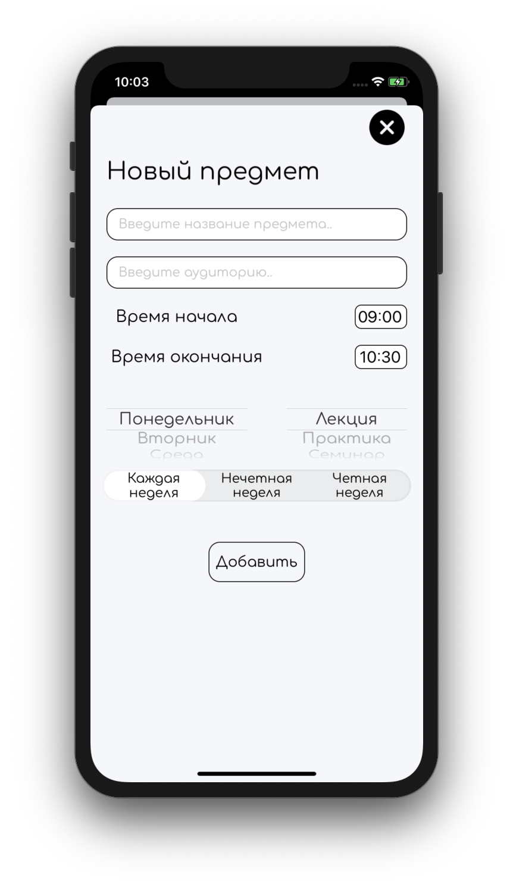
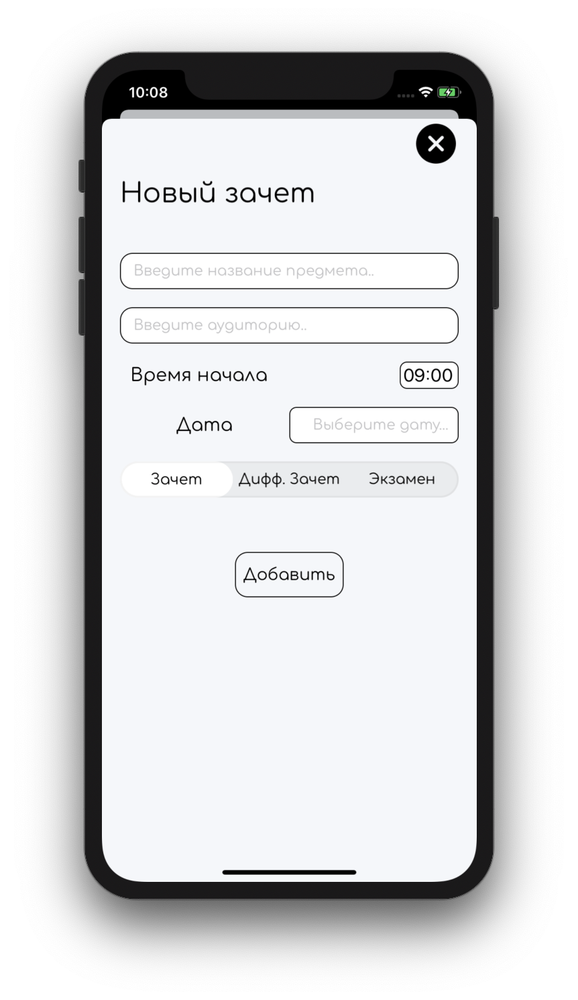
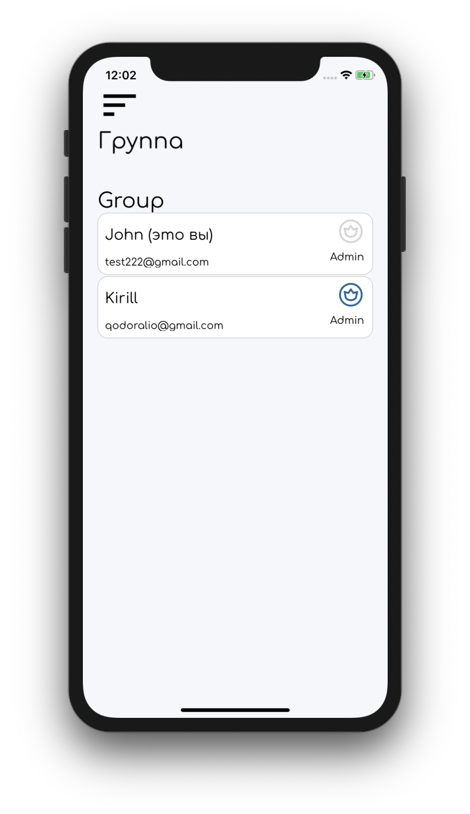

# ScheduleApp
The application is convenient schedule for students. It uses Realtime Database by Firebase.

### Sign Up / Login
If you have already registered, you can enter your email and password to log in.

If you have not registered yet, you should enter email, password and name on sign up page. 
Also you need to select your University and group or create them, if they are not created yet.

  

### Schedule / Examination

The entered subjects will be displayed on this page. The subject has this information:
 - Name
 - Start and end time
 - Classroom
 - Parity (Every week, only odd/even)
 - Type (Lecture, practice, seminar, laboratory)
 
The same for examination page.

 

Each group has "admins", which allowed to add new subjects and exams or change created ones.

 

### "Admins"

The first "admin" is always the student which create that schedule. 
This title can be given to another students in the group by another "admin".

